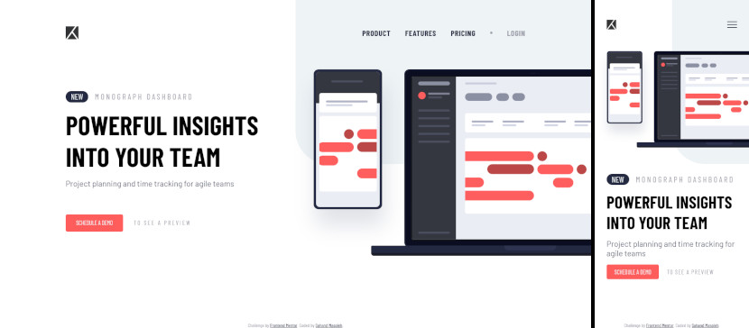

# Frontend Mentor - Project tracking intro component solution

This is a solution to the [Project tracking intro component challenge on Frontend Mentor](https://www.frontendmentor.io/challenges/project-tracking-intro-component-5d289097500fcb331a67d80e). Frontend Mentor challenges help you improve your coding skills by building realistic projects.

## Table of contents

- [The challenge](#the-challenge)
- [Demo](#demo)
- [Links](#links)
- [Built with](#built-with)
- [Author](#author)

### The challenge

Users should be able to:

- View the optimal layout for the site depending on their device's screen size
- See hover states for all interactive elements on the page
- Create the background shape using code

### Demo

### Links

- Solution URL: [Github](https://github.com/sahand-masoleh/fem-33-project-tracking-intro-component)
- Live Site URL: [Github Pages](https://sahand-masoleh.github.io/fem-33-project-tracking-intro-component)

### Built with

- HTML
- SCSS

## Author

- Frontend Mentor - [@sahand-masoleh](https://www.frontendmentor.io/profile/sahand-masoleh)
- Twitter - [@SahandMasoleh](https://twitter.com/SahandMasoleh)
